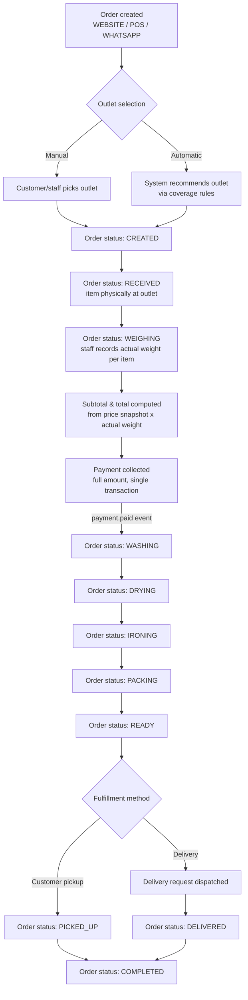
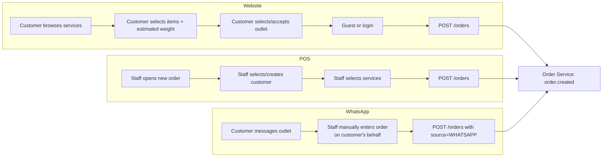
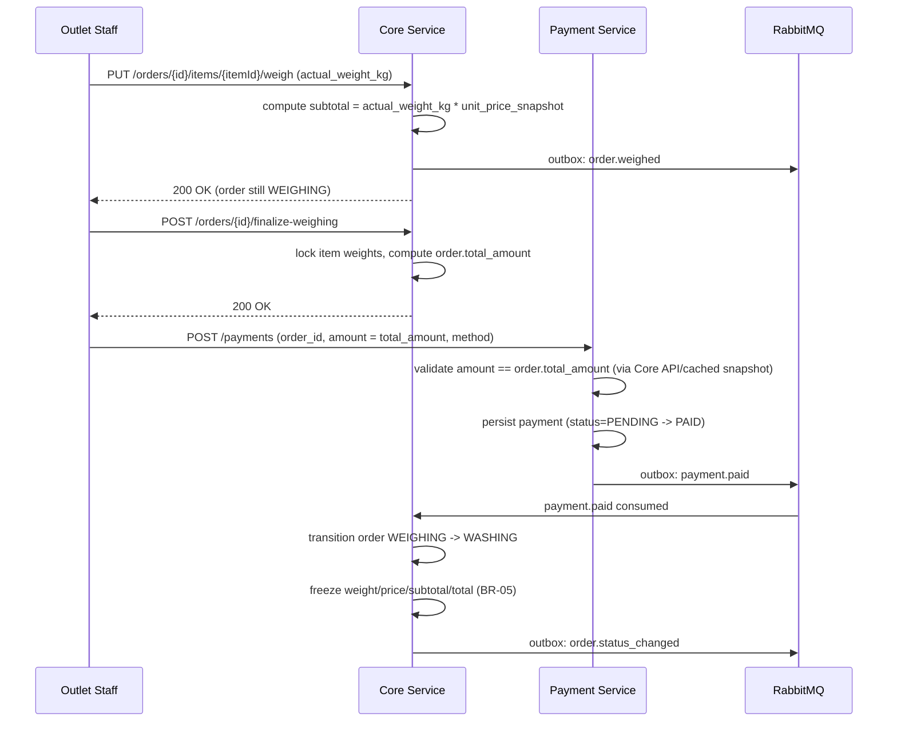
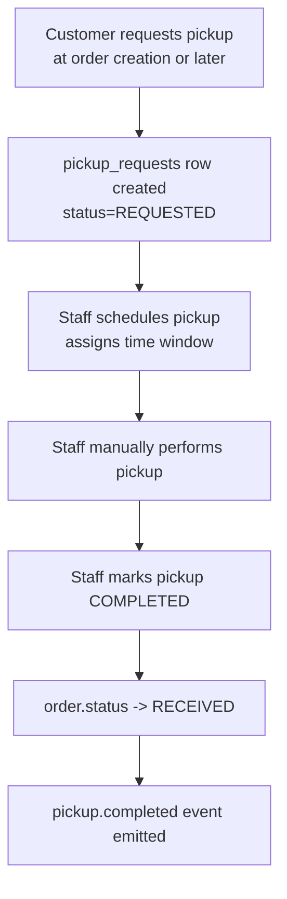
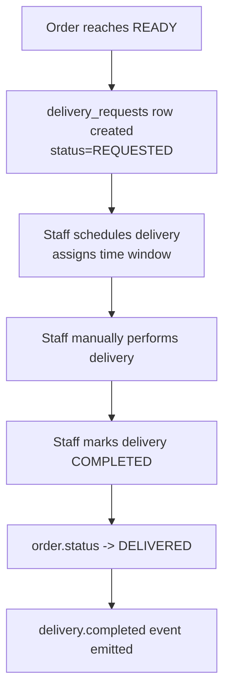
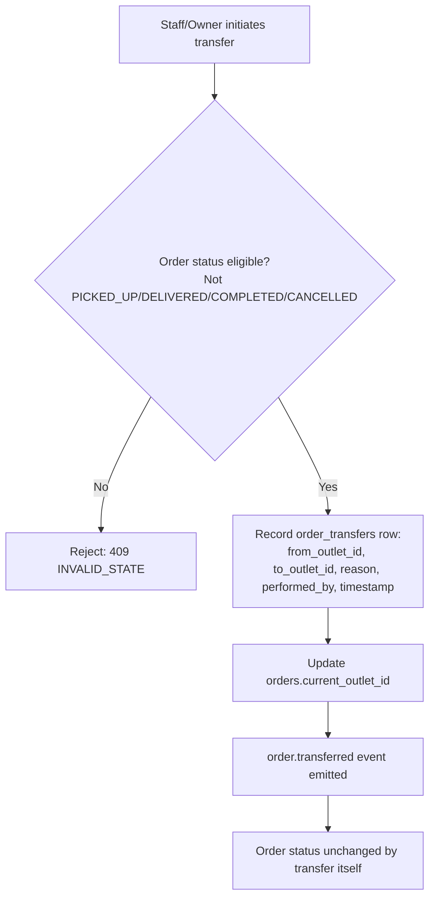
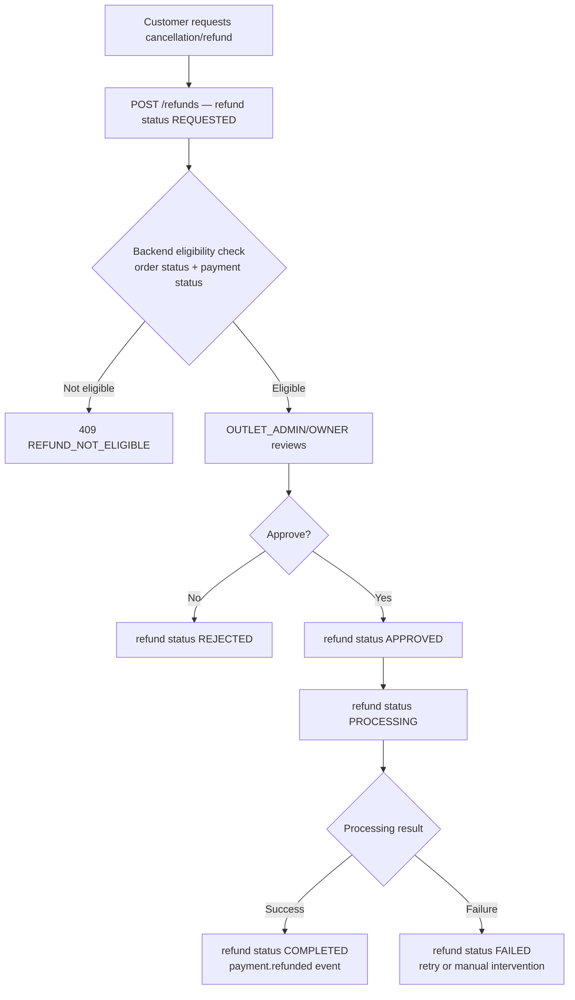

# 02 — Business Workflow

References: `01-business-rules.md` (BR-xx), `10-state-machines.md` for the formal order/refund state machines.

---

## 1. End-to-End Order Workflow (Happy Path)

Notes:
- The transition `WEIGHING → WASHING` is **gated on payment** (BR-02, BR-06, BR-07). It is not purely a staff action; Core Service will not allow it until Payment Service confirms `payment.paid` for the order — with one narrow, audited exception: `OWNER`/`SUPER_ADMIN` may force it via the administrative override (BR-26, `10-state-machines.md` §1.3), which still requires `payment_status = PAID` before the order can later reach `COMPLETED`.
- `ON_HOLD` and `CANCELLED` are reachable from most intermediate states — see `10-state-machines.md` for the exhaustive transition table.

---

## 2. Order Creation Workflow (by channel)

---

## 3. Weighing & Payment Workflow

---

## 4. Pickup Workflow (manual)

No driver app or GPS: scheduling and completion are manual staff actions recorded via API (`13-...` not applicable; see `07-api-contract.md` §Pickup).

---

## 5. Delivery Workflow (manual)

---

## 6. Outlet Transfer Workflow

Order status is **not** affected by an outlet transfer (see BR-10/BR-11 and `10-state-machines.md`). Transfer is an orthogonal audit-tracked relocation, not a status transition.

---

## 7. Cancellation / Refund Workflow

Full detail (roles, eligibility rules, order-status interaction) in `10-state-machines.md` §2 and `15` cross-reference.

---

## 8. Workflow-to-Service Mapping

| Workflow step | Owning service | Key event(s) emitted |
|---|---|---|
| Order creation | Core | `order.created` |
| Weighing | Core | `order.weighed` |
| Payment | Payment | `payment.created`, `payment.paid`, `payment.failed` |
| Status progression | Core | `order.status_changed` |
| Pickup | Core | `pickup.requested`, `pickup.completed` |
| Delivery | Core | `delivery.requested`, `delivery.completed` |
| Outlet transfer | Core | `order.transferred` |
| Refund | Payment | `payment.refunded` |
| Notifications (any of the above) | Notification (consumer) | — (consumes events, no domain events of its own beyond delivery receipts) |
| Reporting | Reporting (consumer) | — (builds read models from all of the above) |
