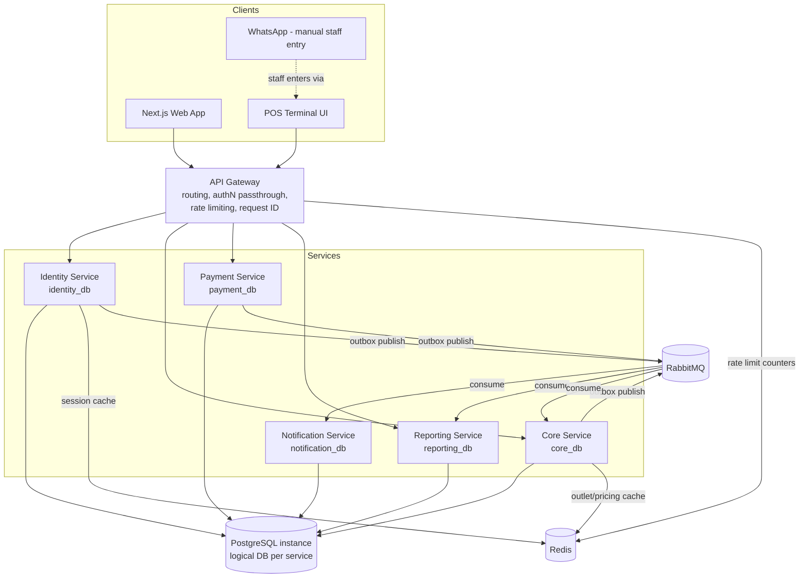

# 03 — System Architecture

## 1. System Architecture Diagram



Key properties:
- The **Gateway** is the only entry point for clients. No service is directly reachable from the internet.
- **RabbitMQ** carries all cross-service domain events (via the Outbox Pattern — see `10-...`/`08-event-contract.md`). No service calls another service's database.
- **Redis** is used for session/token cache, rate-limiting counters, and read-through caches for hot, rarely-changing data (e.g., active global pricing, outlet list). Redis is not a system of record.
- **PostgreSQL**: one physical instance during development, hosting five logical databases (`identity_db`, `core_db`, `payment_db`, `notification_db`, `reporting_db`) each with its own schema/role. Physical separation into distinct instances is a deployment-time change, not an architecture change.

---

## 2. Synchronous vs. Asynchronous Communication

| Interaction | Style | Rationale |
|---|---|---|
| Client → Gateway → Service (request/response, e.g., create order, login) | Synchronous REST | User-facing, needs immediate response |
| Service → Service, read of another service's owned data needed for validation (e.g., Payment needs Core's order total) | Synchronous REST, service-to-service, authenticated (see `12-security-baseline.md`) | Needed for real-time consistency checks; kept minimal |
| Domain fact broadcast (order created, payment paid, etc.) | Asynchronous event via RabbitMQ (Outbox Pattern) | Decouples services, survives consumer downtime, enables Notification/Reporting without coupling Core/Payment to them |

Rule: **synchronous service-to-service calls are for validation/read-only lookups only; state-changing side effects across services must go through events.** This prevents distributed transactions and keeps each service the sole writer of its own data.

---

## 3. Repository Architecture (Monorepo)

```
laundry-platform/
├── services/
│   ├── identity/        # Identity Service (Go module)
│   ├── core/            # Core Service (Go module)
│   ├── payment/         # Payment Service (Go module)
│   ├── notification/    # Notification Service (Go module)
│   └── reporting/       # Reporting Service (Go module)
├── gateway/              # API Gateway (Go module)
├── web/                  # Next.js frontend
├── shared/               # See §4 below — strictly limited
├── deployments/          # Docker/Compose/K8s manifests, env templates
├── docs/                 # This document set (source of truth)
└── scripts/              # Dev tooling: bootstrap, codegen, migration runner wrappers
```

Each service under `services/*` is an independently buildable/deployable Go module with its own `go.mod`, its own database migrations, and its own OpenAPI fragment. The monorepo aids coordinated changes and shared tooling; it does **not** imply shared runtime or shared database.

## 4. What Is Allowed Inside `shared/`

`shared/` may contain **only** cross-cutting, business-logic-free code:

**Allowed:**
- Generated API/event types (OpenAPI/JSON-Schema generated structs) — read-only artifacts, not hand-authored business types
- Common infrastructure wrappers: logging setup, OpenTelemetry tracing bootstrap, RabbitMQ outbox publisher/consumer helper, Postgres/pgx connection helpers, Redis client wrapper
- Common HTTP middleware with no business meaning: request-ID injection, panic recovery, structured error envelope encoding (the *shape*, not domain error codes)
- Common validation primitives (e.g., UUID format, money type helpers) that encode no business rule
- Linting/formatting configuration, Makefile fragments

**Not allowed:**
- Any type or function that encodes a business rule from `01-business-rules.md` (e.g., no shared "OrderCalculator", no shared "RefundEligibilityChecker")
- Any direct database model/repository shared across services
- Any service reaching into another service's package to call its internal logic in-process

Rationale: `shared/` exists to avoid duplicating *plumbing*, never to avoid duplicating *domain logic*. Domain logic duplication across services is acceptable and expected at boundaries (e.g., both Core and Payment independently validate an order's total before acting) — this is intentional defense in depth, not technical debt.

## 5. Deployment Topology (Dev vs. later)

| Aspect | Development (Phase 1 target) | Future |
|---|---|---|
| PostgreSQL | 1 instance, 5 logical databases, 5 roles | Optionally split per service instance for isolation/scale |
| RabbitMQ | 1 instance, per-service exchanges/queues | Can cluster |
| Redis | 1 instance, key-prefixed per service | Can shard/cluster |
| Services | `docker compose` — one container per service + gateway + web | Kubernetes, one deployment per service |
| Gateway | Single instance behind a reverse proxy | Horizontally scaled, stateless |

## 6. Diagram Index

This document set contains the following diagrams, distributed by topic:

| # | Diagram | Location |
|---|---|---|
| 1 | System architecture | `03-system-architecture.md` §1 |
| 2 | Business workflow (multiple) | `02-business-workflow.md` |
| 3 | Order lifecycle (state machine) | `10-state-machines.md` §1 |
| 4 | Service boundaries | `04-service-boundaries.md` §1 |
| 5 | Database boundaries | `05-database-erd.md` §1 |
| 6 | Main ERD (per service) | `05-database-erd.md` §2-6 |
| 7 | Event flow | `08-event-contract.md` §1 |
| 8 | Authentication flow | `12-security-baseline.md` §2 |
| 9 | Payment flow | `02-business-workflow.md` §3, payment state machine in `10-state-machines.md` §2 |
| 10 | Refund flow | `02-business-workflow.md` §7 / `10-state-machines.md` §3 |
| 11 | Pickup flow | `02-business-workflow.md` §4 |
| 12 | Delivery flow | `02-business-workflow.md` §5 |

Two additional documents complete the set required by the current Master Prompt: `13-observability.md` (logging/metrics/tracing/health-check baseline) and `14-architecture-decisions.md` (ADRs, renumbered from `13-` to make room for the observability doc — see that file's header note).
