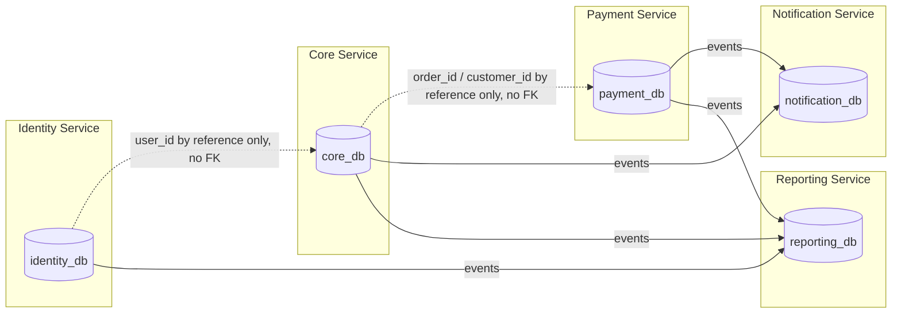

# 04 — Service Boundaries

## 1. Service Boundary Diagram

Dotted lines = logical reference by ID only (never a SQL join, never a foreign key). Solid lines = event flow via RabbitMQ.

---

## 2. Identity Service

**Owns:** users, roles, permissions, user_roles, role_permissions, user_outlets, sessions, **customer_accounts, customer_sessions** (added by the UQ-03 resolution).

**Responsibilities:**
- Staff authentication (login, refresh, logout) and authorization primitives: role/permission definitions, role-permission mapping, user-to-outlet scope assignment, staff session/token lifecycle
- **Customer authentication (UQ-03 resolution):** customer self-service register/login/logout/refresh/password-reset, issuing a distinct `principal_type=CUSTOMER` token that carries no staff role and is rejected by every staff-only endpoint. Kept in this service (rather than a new service) because it is pure authentication/session-lifecycle — the same competency this service already owns for staff — not a new bounded context; only the *data* (`customer_accounts`) is new, not a new responsibility class.

**Does NOT own:** the customer's business profile — name, phone, addresses (that's Core's `customers`/`customer_addresses`; Identity only owns the *login credential*, linked by `customers.identity_account_id` ↔ `customer_accounts.customer_id`), any order/payment data.

**Exposes (sync API):** `/api/v1/auth/*` (staff), `/api/v1/customer-auth/*` (customer, UQ-03), `/api/v1/users/*` (see `07-api-contract.md`).

**Publishes events:** `outbox_events` in `identity_db` — used sparingly (e.g., a future `user.deactivated` event); MVP scope may have zero cross-service events consumed downstream other than Reporting's user-attribution lookups via sync API, not events. The outbox table is still mandated by the platform standard (§10 of the Phase 0 spec) even if event volume starts low.

**Consumes events:** none required for MVP.

**Depends on (sync, read-only):** none.

---

## 3. Core Service

**Owns:** customers, customer_addresses, outlets, outlet_coverage_areas, services, service_prices, **tax_rates** (added by the UQ-09 resolution), orders, order_items, order_status_history, order_transfers, pickup_requests, delivery_requests.

**Responsibilities:**
- Customer profile management (guest and registered), including the logical link to Identity's `customer_accounts` (`customers.identity_account_id`) once a customer self-registers (UQ-03)
- Outlet directory and coverage-based outlet recommendation
- Service catalog and pricing (global today, outlet-scoped-capable schema), and the configurable PPN rate (`tax_rates`, UQ-09) with the same versioned-snapshot pattern as pricing
- Order lifecycle: creation, weighing, status state machine (including the UQ-05 administrative payment-gate override, restricted to `order.override_payment_gate`), transfer, pickup/delivery request tracking
- Enforcing BR-01 through BR-05, BR-08 through BR-15

**Does NOT own:** payment/refund data (Payment Service), customer login credentials (Identity Service's `customer_accounts` — Core owns the customer's *business* profile, Identity owns the *login*), user credentials/roles for staff (Identity Service), notification delivery (Notification Service).

**Exposes (sync API):** `/api/v1/customers/*`, `/api/v1/outlets/*`, `/api/v1/services/*`, `/api/v1/pricing/*`, `/api/v1/settings/tax-rate` (UQ-09), `/api/v1/orders/*`, `/api/v1/orders/{id}/weigh`, `/api/v1/orders/{id}/status`, `/api/v1/orders/{id}/status/override` (UQ-05), `/api/v1/orders/{id}/transfer`, `/api/v1/pickups/*`, `/api/v1/deliveries/*`.

**Publishes events:** `order.created`, `order.weighed`, `order.status_changed`, `order.payment_overridden` (UQ-05), `order.transferred`, `order.cancelled`, `order.completed`, `pickup.requested`, `pickup.completed`, `delivery.requested`, `delivery.completed`.

**Consumes events:** `payment.paid`, `payment.failed`, `payment.refunded` (to drive the order state machine and reflect refund impact on order status where applicable).

**Depends on (sync, read-only):** Identity Service (to resolve `performed_by` user identity/role at write time, if not already carried in the auth context propagated by the Gateway).

**Explicit non-split rule:** Per the Phase 0 spec, Core Service is **not** decomposed further at this stage (no separate "Order Service", "Catalog Service", "Outlet Service") to avoid a distributed monolith. This will be revisited only if a bounded context clearly outgrows shared operational characteristics (deploy cadence, team ownership, scaling profile).

---

## 4. Payment Service

**Owns:** payments, payment_transactions, refunds.

**Responsibilities:**
- Recording payment attempts and outcomes against an order (by `order_id` reference, no FK)
- Enforcing BR-06, BR-07 (full-amount-only payment)
- Refund state machine (BR-16 through BR-19)

**Does NOT own:** the order itself, order status, weight, or pricing — Payment Service treats `order_id`, `amount_due`, and `customer_id` as inputs supplied by the caller and/or validated via a synchronous read against Core Service.

**Exposes (sync API):** `/api/v1/payments/*`, `/api/v1/refunds/*`.

**Publishes events:** `payment.created`, `payment.paid`, `payment.failed`, `payment.refunded`.

**Consumes events:** `order.cancelled` (to flag any in-flight payment as void where applicable).

**Depends on (sync, read-only):** Core Service — to fetch/verify the authoritative `order.total_amount` at the moment a payment is initiated (defense-in-depth alongside the amount the client submits).

---

## 5. Notification Service

**Owns:** notifications, notification_deliveries.

**Responsibilities:**
- Consuming domain events from Core/Payment (and Identity if applicable) and generating outbound notifications (e.g., SMS/WhatsApp/email templates — actual channel integration is a Phase 1+ concern; Phase 0 defines only the data model and event contract)
- Recording delivery attempts/status per notification

**Does NOT own:** any business/domain data — it is purely a consumer/side-effect service.

**Exposes (sync API):** minimal — `/api/v1/notifications` (list/read, for admin/debug visibility) as read-only.

**Publishes events:** none required cross-service (notification delivery status is internal to this service; it is not a fact other services need to react to in MVP).

**Consumes events:** `order.created`, `order.status_changed`, `order.completed`, `order.cancelled`, `payment.paid`, `payment.failed`, `payment.refunded`, `pickup.requested`, `pickup.completed`, `delivery.requested`, `delivery.completed`.

---

## 6. Reporting Service

**Owns:** reporting read models / projection tables only (no transactional/write-path data).

**Responsibilities:**
- Consuming all relevant domain events and materializing denormalized read models for dashboards/analytics (sales by outlet, order throughput, refund rate, etc.)
- Serving read-only reporting APIs

**Does NOT own:** any transactional data; never a system of record.

**Exposes (sync API):** `/api/v1/reports/*` (read-only).

**Publishes events:** none.

**Consumes events:** all published domain events (`order.*`, `payment.*`, `pickup.*`, `delivery.*`).

**Note on outbox:** Reporting is a pure event **sink** with no outward-facing domain events, so — unlike the other four services — it has no requirement to publish its own outbox events. It still needs an internal **inbox/idempotency ledger** (recording `event_id`s already applied) to make projection rebuilding idempotent; see `08-event-contract.md` §4.

---

## 7. Cross-Service Rules (Anti-Distributed-Monolith)

1. A service's database is private. No other service, and no shared reporting job, may connect directly to it. (Reporting subscribes to events; it never queries `core_db` directly.)
2. No cross-service foreign keys. Cross-service references are UUIDs stored as plain columns, validated by API/event contract, not by the database.
3. Synchronous service-to-service calls are read-only lookups, always through the callee's public API (never internal package calls, even within the same monorepo/binary).
4. Every state-changing fact that another service needs must be published as a versioned event via that service's own outbox — never inferred by another service polling a table.
5. Each service's OpenAPI fragment and event schemas are the only public contract; internal domain models can change freely as long as the contract is versioned appropriately.
