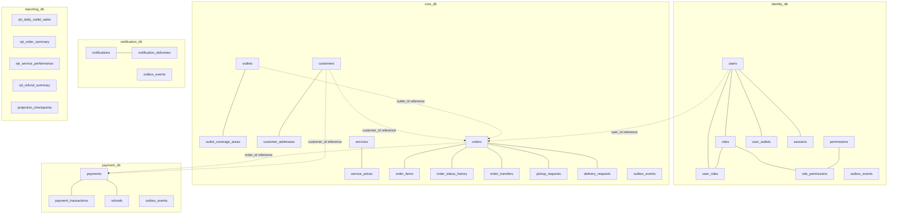
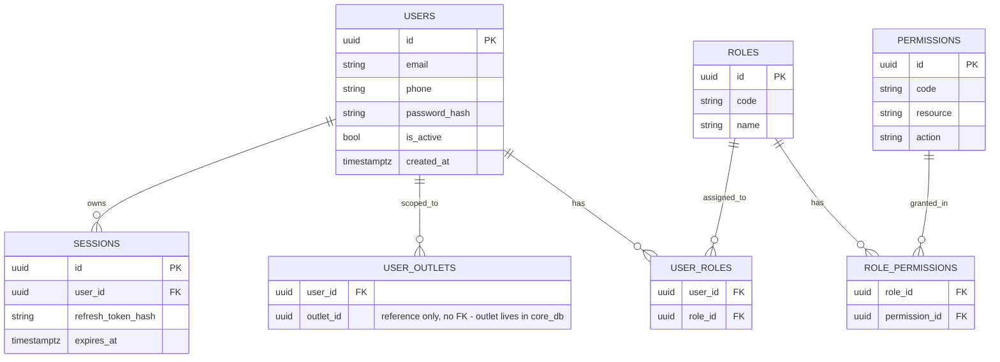
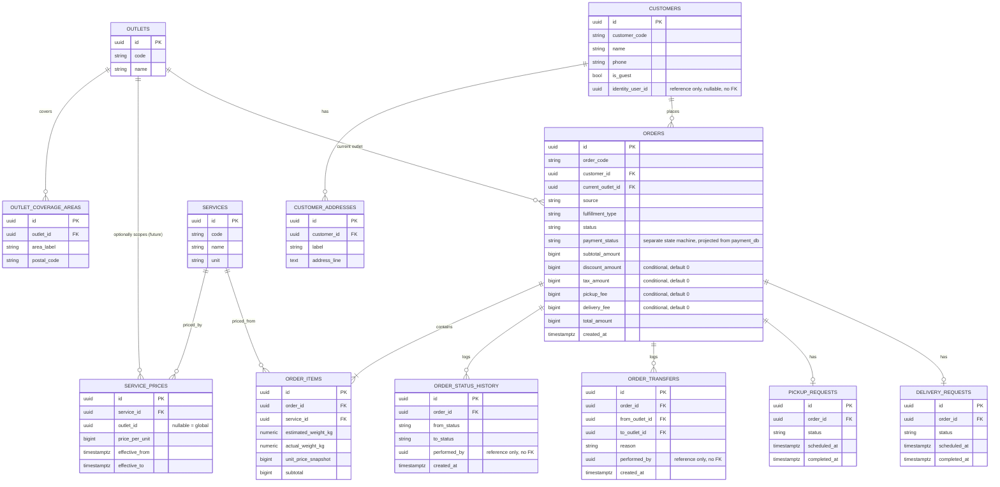
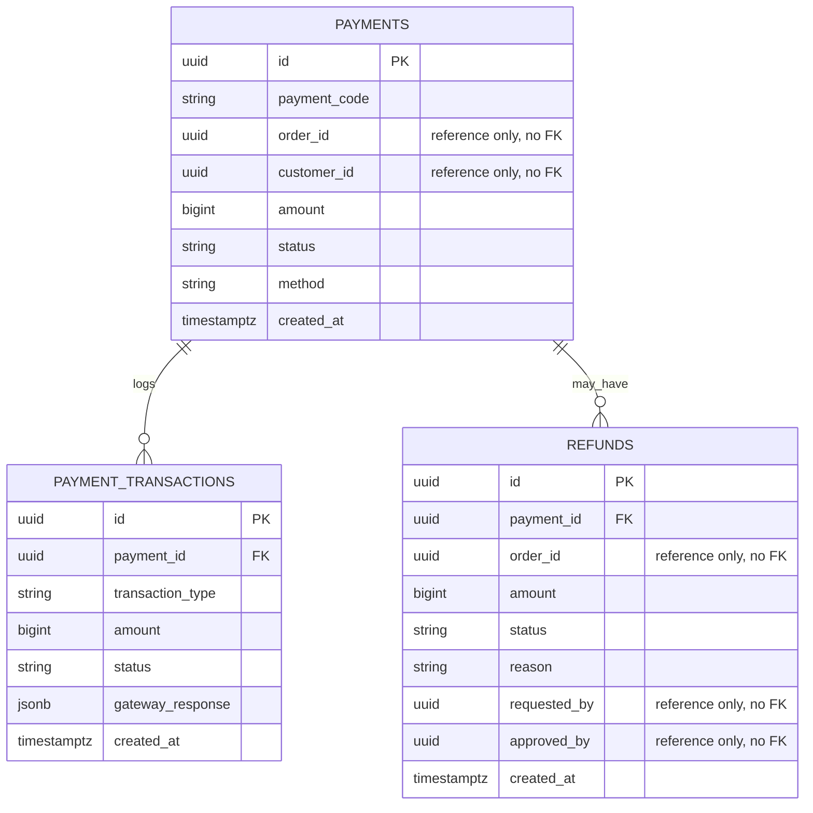
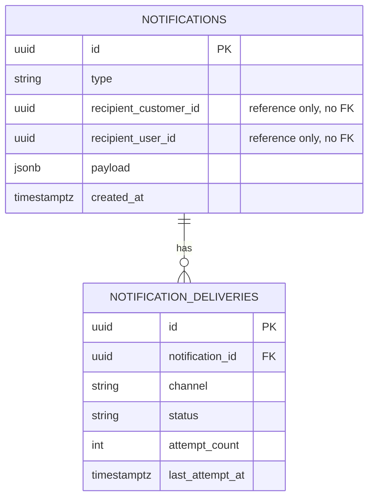
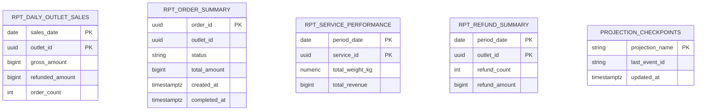

# 05 — Database ERD

Logical database-per-service. All cross-service relationships shown as dashed/no-FK "reference" notes, never actual foreign keys. Full column-level spec is in `06-database-schema.md`; this document is the relationship map.

## 1. Database Boundary Diagram

---

## 2. Identity ERD

---

## 3. Core ERD

---

## 4. Payment ERD

---

## 5. Notification ERD

---

## 6. Reporting ERD (Read Models)

Reporting tables are rebuildable at any time by replaying events from the earliest retained offset; `projection_checkpoints` tracks per-projection idempotency (see `08-event-contract.md` §4).

## 7. Cross-Service Reference Rule

Every `uuid ... "reference only, no FK"` field above is validated at the application layer (existence checked via the owning service's synchronous API when correctness matters at write time, e.g., Payment validating `order_id` against Core) and/or trusted from the event payload that originated it. No migration in any service may add a `REFERENCES` clause pointing at a table in another service's database.
