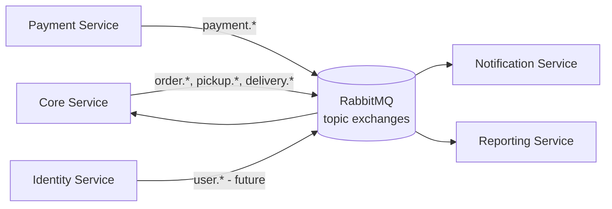

# 08 — Event Contract

## 1. Event Flow Diagram



Exchange layout: one **topic exchange per producing service** (`core.events`, `payment.events`, `identity.events`), routing key = `event_type` (e.g. `order.created`). Each consumer declares its own durable queue bound with the routing keys it needs, so Notification and Reporting can evolve their interests independently without touching the producer.

---

## 2. Event Envelope

Every event, regardless of type, uses this envelope:

```json
{
  "event_id": "uuid",
  "event_type": "order.created",
  "event_version": 1,
  "occurred_at": "2026-09-15T08:30:00Z",
  "producer": "core-service",
  "aggregate_type": "order",
  "aggregate_id": "uuid",
  "correlation_id": "uuid",
  "payload": { }
}
```

| Field | Type | Notes |
|---|---|---|
| event_id | UUID | globally unique, equals the `outbox_events.id` that produced it — used as the idempotency key by every consumer |
| event_type | string | dot-namespaced, e.g. `order.status_changed` |
| event_version | int | incremented on breaking payload changes; consumers must ignore unknown fields (additive changes are non-breaking) |
| occurred_at | RFC3339 timestamp | business time of the fact, not publish time |
| producer | string | service name that emitted it |
| aggregate_type | string | e.g. `order`, `payment` |
| aggregate_id | UUID | the entity the event is about |
| correlation_id | UUID | identifies the broader business operation this event is part of (e.g., the original `request_id` that created the order); see `13-observability.md` §3-4. Distinct from `event_id`, which identifies only this one event. |
| payload | object | event-specific, see §3 |

---

## 3. Event Definitions & Examples

### Order events (producer: `core-service`)

**`order.created`**
```json
{
  "event_id": "b1a2c3d4-0000-0000-0000-000000000001",
  "event_type": "order.created",
  "event_version": 1,
  "occurred_at": "2026-09-15T08:30:00Z",
  "producer": "core-service",
  "aggregate_type": "order",
  "aggregate_id": "3f2a...order-uuid",
  "payload": {
    "order_id": "3f2a...order-uuid",
    "order_code": "ORD-20260915-000123",
    "customer_id": "c9b1...cust-uuid",
    "outlet_id": "1a2b...outlet-uuid",
    "source": "WEBSITE",
    "items": [
      { "service_id": "svc-uuid-1", "estimated_weight_kg": "3.500" }
    ]
  }
}
```

**`order.weighed`**
```json
{
  "event_type": "order.weighed",
  "event_version": 1,
  "aggregate_type": "order",
  "payload": {
    "order_id": "3f2a...order-uuid",
    "items": [
      { "order_item_id": "oi-uuid-1", "actual_weight_kg": "3.750", "unit_price_snapshot": 8000, "subtotal": 30000 }
    ],
    "total_amount": 30000
  }
}
```

**`order.status_changed`**
```json
{
  "event_type": "order.status_changed",
  "event_version": 1,
  "aggregate_type": "order",
  "payload": {
    "order_id": "3f2a...order-uuid",
    "from_status": "WEIGHING",
    "to_status": "WASHING",
    "performed_by": "user-uuid | null (system, e.g. payment-triggered)",
    "reason": null
  }
}
```

**`order.payment_overridden`** (**UQ-05 resolution** — emitted in addition to `order.status_changed` whenever the `WEIGHING → WASHING` transition is performed via the administrative override described in `10-state-machines.md` §1.3, so Notification/Reporting can track it distinctly from normal payment-triggered transitions without parsing `order.status_changed` payloads)
```json
{
  "event_type": "order.payment_overridden",
  "event_version": 1,
  "aggregate_type": "order",
  "payload": {
    "order_id": "3f2a...order-uuid",
    "order_code": "ORD-20260915-000001",
    "overridden_by": "user-uuid (OWNER or SUPER_ADMIN)",
    "reason": "Corporate account PT XYZ - net-30 invoice",
    "payment_status_at_override": "UNPAID",
    "total_amount": 57000
  }
}
```

**`order.transferred`**
```json
{
  "event_type": "order.transferred",
  "event_version": 1,
  "aggregate_type": "order",
  "payload": {
    "order_id": "3f2a...order-uuid",
    "from_outlet_id": "outlet-uuid-a",
    "to_outlet_id": "outlet-uuid-b",
    "reason": "Customer requested nearer outlet for pickup",
    "performed_by": "user-uuid"
  }
}
```

**`order.cancelled`**
```json
{
  "event_type": "order.cancelled",
  "event_version": 1,
  "aggregate_type": "order",
  "payload": { "order_id": "3f2a...order-uuid", "reason": "Customer cancelled before processing", "performed_by": "user-uuid" }
}
```

**`order.completed`**
```json
{
  "event_type": "order.completed",
  "event_version": 1,
  "aggregate_type": "order",
  "payload": { "order_id": "3f2a...order-uuid", "completed_at": "2026-09-17T10:00:00Z" }
}
```

### Payment events (producer: `payment-service`)

**`payment.created`**
```json
{
  "event_type": "payment.created",
  "event_version": 1,
  "aggregate_type": "payment",
  "payload": { "payment_id": "pay-uuid", "payment_code": "PAY-20260915-000045", "order_id": "3f2a...order-uuid", "amount": 30000, "method": "QRIS", "status": "PENDING" }
}
```

**`payment.paid`**
```json
{
  "event_type": "payment.paid",
  "event_version": 1,
  "aggregate_type": "payment",
  "payload": { "payment_id": "pay-uuid", "order_id": "3f2a...order-uuid", "amount": 30000, "paid_at": "2026-09-15T09:10:00Z" }
}
```

**`payment.failed`**
```json
{
  "event_type": "payment.failed",
  "event_version": 1,
  "aggregate_type": "payment",
  "payload": { "payment_id": "pay-uuid", "order_id": "3f2a...order-uuid", "reason": "GATEWAY_TIMEOUT" }
}
```

**`payment.refunded`**
```json
{
  "event_type": "payment.refunded",
  "event_version": 1,
  "aggregate_type": "payment",
  "payload": { "payment_id": "pay-uuid", "order_id": "3f2a...order-uuid", "refund_id": "rfd-uuid", "amount": 30000, "processed_at": "2026-09-18T12:00:00Z" }
}
```

### Pickup events (producer: `core-service`)

**`pickup.requested`**
```json
{ "event_type": "pickup.requested", "event_version": 1, "aggregate_type": "pickup_request",
  "payload": { "pickup_id": "pu-uuid", "order_id": "3f2a...order-uuid", "address_id": "addr-uuid" } }
```

**`pickup.completed`**
```json
{ "event_type": "pickup.completed", "event_version": 1, "aggregate_type": "pickup_request",
  "payload": { "pickup_id": "pu-uuid", "order_id": "3f2a...order-uuid", "completed_at": "2026-09-15T07:00:00Z" } }
```

### Delivery events (producer: `core-service`)

**`delivery.requested`**
```json
{ "event_type": "delivery.requested", "event_version": 1, "aggregate_type": "delivery_request",
  "payload": { "delivery_id": "dl-uuid", "order_id": "3f2a...order-uuid", "address_id": "addr-uuid" } }
```

**`delivery.completed`**
```json
{ "event_type": "delivery.completed", "event_version": 1, "aggregate_type": "delivery_request",
  "payload": { "delivery_id": "dl-uuid", "order_id": "3f2a...order-uuid", "completed_at": "2026-09-17T10:00:00Z" } }
```

---

## 4. Outbox Publishing Flow, Retry, and Idempotency

### Publishing flow (per service, identical pattern)
1. Business transaction writes domain rows **and** an `outbox_events` row (`status='PENDING'`) in the **same DB transaction**. This guarantees the event is never lost if publishing fails after commit (Phase 0 spec §10's core failure mode: "DB transaction succeeds but event publishing is lost").
2. A background **relay poller** (or Postgres `LISTEN/NOTIFY` triggered worker) reads `PENDING` rows ordered by `created_at`, publishes to the service's RabbitMQ topic exchange with `event_id` as the message ID and publisher-confirm enabled.
3. On broker ack, the poller sets `status='PUBLISHED'`, `published_at=now()`.
4. On failure (broker unreachable, nack), `retry_count += 1`, row remains `PENDING`; poller retries with exponential backoff (base 1s, cap 60s, indefinite retries — an unpublished outbox row is a paging alert past a threshold, e.g. `retry_count > 20` or age `> 15 min`).
5. Rows are never deleted immediately after publish; they are retained for a rolling window (e.g., 7 days) for replay/debugging, then archived alongside the retention policy (BR-20 philosophy applied to the outbox too).

### Consumer idempotency
- Every consumer (Notification, Reporting, Core-as-consumer-of-payment-events) persists the `event_id` it has processed (`notifications.source_event_id` unique constraint; `projection_checkpoints` for Reporting; an equivalent dedup table for Core consuming `payment.*`).
- Before applying an event, the consumer checks "have I already applied this `event_id`?" — if yes, it acks and skips (safe redelivery). This makes **at-least-once delivery** (RabbitMQ's guarantee) behave as **effectively-once processing**.

### Failure handling
- Consumer processing failure → message is `nack`'d with requeue to a **per-queue dead-letter exchange** after N redelivery attempts (e.g., 5), so a poison message cannot block the queue indefinitely.
- Dead-lettered messages are inspected/replayed manually via an admin tool (Phase 1+ concern) — Phase 0 only mandates the DLX exists.

### Versioning strategy
- `event_version` increments only on breaking payload changes (field removed/renamed/type changed). Additive fields do not bump the version. Consumers must tolerate unknown fields (forward compatibility) and are expected to explicitly branch on `event_version` when it changes.
