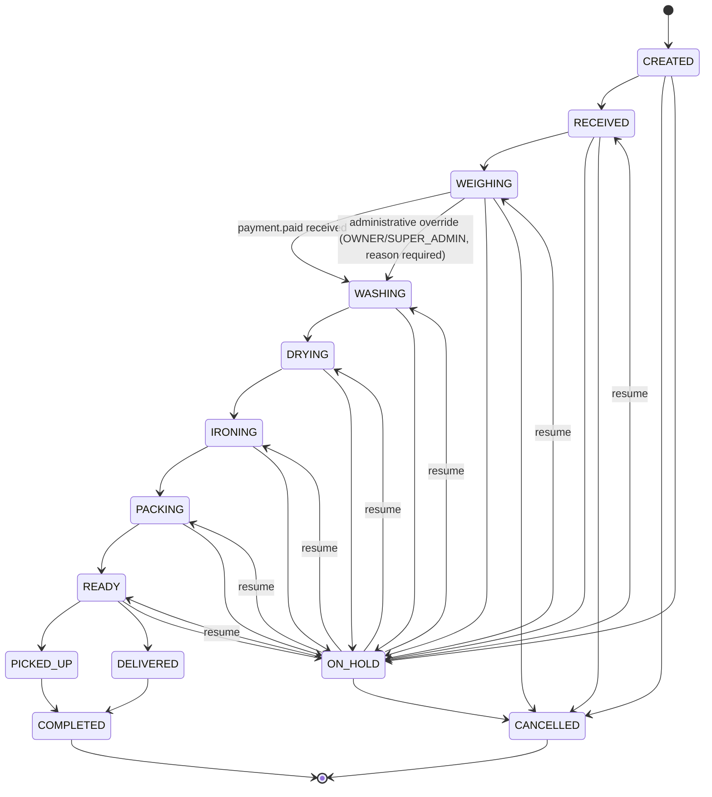
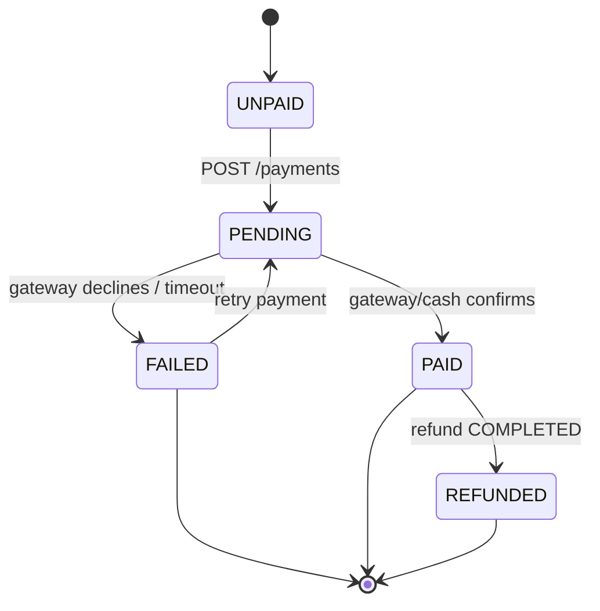
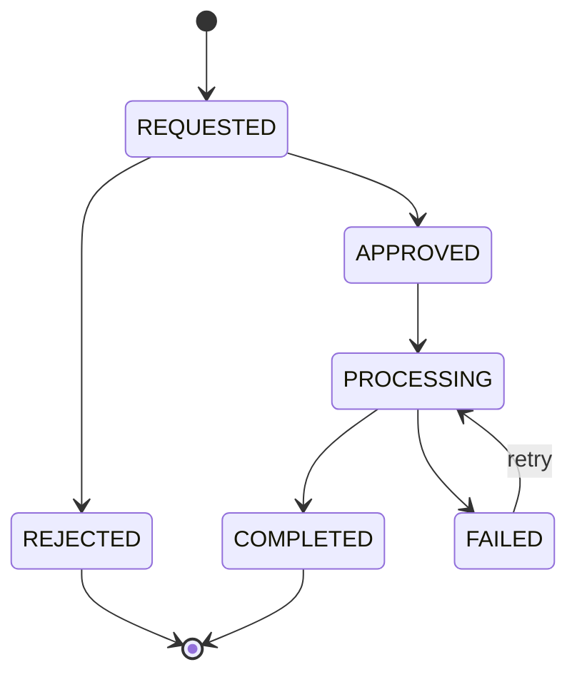

# 10 — State Machines

## 1. Order Status State Machine

`ON_HOLD` is modeled as a single status with an internal "resume target" recorded in `order_status_history.payload`/`reason` (the status the order was in before being put on hold), so resuming returns it to that exact prior status rather than restarting the pipeline.

### 1.1 Transition Table

| From | To | Allowed roles | Required conditions | Audit |
|---|---|---|---|---|
| — | CREATED | any authenticated principal or guest (order.create) | items non-empty, outlet resolved | `order_status_history` row with `from_status=NULL` |
| CREATED | RECEIVED | CASHIER, LAUNDRY_STAFF, OUTLET_ADMIN+ | item physically at outlet (manual confirmation) OR pickup.completed event | history row |
| RECEIVED | WEIGHING | CASHIER, LAUNDRY_STAFF, OUTLET_ADMIN+ | at least one item weighed | history row |
| WEIGHING | WASHING | **System** (triggered by `payment.paid` event, not a direct user action) | finalize-weighing done AND payment.paid received for this order (BR-02) | history row, `performed_by = NULL` (system), cross-referenced to `payment_id` |
| WEIGHING | WASHING | **OWNER, SUPER_ADMIN only** — `order.override_payment_gate` permission (**UQ-05 resolution**, see §1.3) | finalize-weighing done; `reason` mandatory; `payment_status` remains whatever it was (typically `UNPAID`/`PENDING`) — **not** required to be `PAID` | history row with `is_administrative_override = true`, `reason` NOT NULL, emits `order.payment_overridden` (see `08-event-contract.md`) |
| WASHING | DRYING | LAUNDRY_STAFF, OUTLET_ADMIN+ | — | history row |
| DRYING | IRONING | LAUNDRY_STAFF, OUTLET_ADMIN+ | — | history row |
| IRONING | PACKING | LAUNDRY_STAFF, OUTLET_ADMIN+ | — | history row |
| PACKING | READY | LAUNDRY_STAFF, OUTLET_ADMIN+ | — | history row |
| READY | PICKED_UP | CASHIER, LAUNDRY_STAFF, OUTLET_ADMIN+ | customer physically collects (manual confirmation) | history row |
| READY | DELIVERED | CASHIER, LAUNDRY_STAFF, OUTLET_ADMIN+ | delivery.completed recorded | history row |
| PICKED_UP | COMPLETED | CASHIER, OUTLET_ADMIN+, or **System** (auto after N hours) | **`payment_status = 'PAID'`** (BR-02 money-safety net — see §1.3: this is the condition that actually closes the gap opened by an administrative override) | history row |
| DELIVERED | COMPLETED | CASHIER, OUTLET_ADMIN+, or **System** (auto after N hours) | **`payment_status = 'PAID'`** (same as above) | history row |
| {CREATED, RECEIVED, WEIGHING, WASHING, DRYING, IRONING, PACKING, READY} | ON_HOLD | OUTLET_ADMIN+ | `reason` required | history row |
| ON_HOLD | (prior status) | OUTLET_ADMIN+ | — | history row |
| {CREATED, RECEIVED, WEIGHING, ON_HOLD} | CANCELLED | CASHIER (only before payment), OUTLET_ADMIN+ | `reason` required; if a payment exists and is `PAID`, cancellation instead routes through the **refund workflow** (§2) and does not directly cancel the order — order cancellation post-payment is a consequence of a completed refund, not a direct action | history row, may trigger `payment.refunded`-driven order update |

### 1.2 Invalid Transitions (explicit denials)

- `WEIGHING → WASHING` **directly by any role other than OWNER/SUPER_ADMIN** is invalid — for every other role, only the system, upon consuming `payment.paid`, may perform it. The one exception is documented in full in §1.3.
- Any forward skip (e.g., `RECEIVED → PACKING`) is invalid — the pipeline is strictly sequential except via `ON_HOLD`.
- `COMPLETED` and `CANCELLED` are terminal — no outgoing transitions.
- `{PICKED_UP, DELIVERED, COMPLETED, CANCELLED} → *` transfer is invalid (see `04-service-boundaries.md` / order-transfer precondition).
- Cancelling an order with `payment_status = 'PAID'` directly is invalid (`409 REQUIRES_REFUND_WORKFLOW`) — enforces BR-17/BR-19.
- `{PICKED_UP, DELIVERED} → COMPLETED` while `payment_status <> 'PAID'` is invalid (`409 PAYMENT_NOT_COLLECTED`) — this is the rule that keeps the §1.3 override safe: overriding only waives the gate at `WEIGHING → WASHING`, never the requirement to eventually collect payment before the order closes.

### 1.3 Administrative Payment-Gate Override (UQ-05 resolution)

The Master Prompt (§7) treats any `WASHING`-class shortcut as invalid "unless an explicit administrative correction workflow exists." Business confirmation resolved UQ-05 as follows: **an explicit, audited override is in scope**, restricted to a narrow purpose (e.g. trusted corporate accounts billed on account/invoice-later) rather than a general bypass.

- **Who:** `OWNER` or `SUPER_ADMIN` only (permission `order.override_payment_gate`, see `09-rbac.md`). Never `OUTLET_ADMIN`, `CASHIER`, or `LAUNDRY_STAFF` — the override is a business-level exception, not an operational shortcut.
- **Precondition:** finalize-weighing must already be done (the order must be in `WEIGHING` with `total_amount` computed) — the override waives the *payment* gate only, never the *weighing* gate.
- **Required input:** `reason` (free text, mandatory, e.g. "Corporate account PT XYZ — net-30 invoice") — enforced at the API layer (`400 REASON_REQUIRED` if omitted) and at the DB layer (`order_status_history.reason NOT NULL` whenever `is_administrative_override = true`).
- **What it does NOT change:** `orders.payment_status` is left exactly as it was (typically `UNPAID`). The order proceeds through `WASHING → … → READY → PICKED_UP/DELIVERED` normally, but **cannot reach `COMPLETED`** until `payment_status` becomes `PAID` through the normal Payment Service flow (§1.2's new invalid-transition rule) — so the money-safety property BR-02 was protecting (every completed order was paid) is preserved; only the *timing* relative to washing is relaxed for this one exception.
- **Audit:** every override writes an `order_status_history` row with `is_administrative_override = true`, `performed_by`, `reason`, and `created_at`; Core emits `order.payment_overridden` (see `08-event-contract.md`) so Notification/Reporting can surface it (e.g. an outstanding-override dashboard for OWNER).
- **Risk acceptance:** this was Phase 0's highest-rated risk (see `PHASE-0-REVIEW.md` §4). It is accepted, not eliminated — mitigated by restricting the permission to the two most-trusted roles, mandatory reason, full audit trail, and the unconditional `payment_status = PAID` gate before `COMPLETED`.

---

## 2. Payment State Machine

Per Phase 0 spec §8, payment state is a **separate state machine from order status**, owned by Payment Service, and merely *projected* (read-only mirror) onto `orders.payment_status` in Core (see `06-database-schema.md` §2.7).

### 2.1 Payment Transition Table

| From | To | Trigger | Owning service | Order-status effect |
|---|---|---|---|---|
| — | UNPAID | Order created (default state, no `payments` row exists yet) | Core (default column value) | none |
| UNPAID | PENDING | `POST /payments` accepted (amount validated against order total) | Payment | none |
| PENDING | PAID | Payment confirmed (cash: immediate; QRIS/transfer/card: gateway callback in Phase 1+) | Payment | **Order: `WEIGHING → WASHING`** (§1.1) |
| PENDING | FAILED | Gateway declines, times out, or is voided by `order.cancelled` | Payment | none (order stays in `WEIGHING`, unpaid) |
| FAILED | PENDING | Staff/customer retries payment (new `POST /payments`, since BR-06 keeps this 1:1 — a FAILED payment does not block a new attempt) | Payment | none |
| PAID | REFUNDED | Refund state machine (§3) reaches `COMPLETED` | Payment | **Order: `* → CANCELLED`** (reason: Refunded) |

This is intentionally a **different shape** than the order status machine — it is short, has no manual staff-driven intermediate steps, and every transition is either a direct payment action or a side effect of the refund machine. Conflating it with `orders.status` (e.g., inventing an order status called `PAID`) was considered and rejected: order status describes the *physical/operational* stage of the laundry, payment status describes the *financial* stage, and BR-02/BR-04/BR-06 all depend on being able to reason about them independently (e.g., an order can be `WASHING` — operationally past weighing — while its payment is still, transiently, `PENDING` during the sub-second event-propagation window described in `PHASE-0-REVIEW.md` §4 risk 1).

---

## 3. Refund State Machine

### 3.1 Transition Table

| From | To | Who may perform | Eligibility / conditions | Order status interaction | Event emitted | Audit |
|---|---|---|---|---|---|---|
| — | REQUESTED | Customer (self), CASHIER/OUTLET_ADMIN+ (on behalf) | Payment for the order must be `PAID`; order status must not already be `COMPLETED` beyond a configurable eligibility window (e.g., 7 days post-completion — see UQ in review doc) | none yet | — | `refunds` row created |
| REQUESTED | APPROVED | OUTLET_ADMIN, OWNER, SUPER_ADMIN (never customer — BR-18) | `approved_by` recorded | none yet | — | history via `refunds.status` change (no separate history table — status + timestamps suffice given low volume; see `06-database-schema.md`) |
| REQUESTED | REJECTED | OUTLET_ADMIN, OWNER, SUPER_ADMIN | `reason` required | none | — | terminal |
| APPROVED | PROCESSING | System (auto-transition on approval) | — | none | — | — |
| PROCESSING | COMPLETED | System (payment gateway/manual cash refund confirmation) | refund `amount` ≤ original payment `amount` | if order not yet `CANCELLED`, order transitions to `CANCELLED` (reason: "Refunded") **unless** the refund is partial-order/service-adjustment in a future phase — MVP treats all refunds as full-order refunds tied 1:1 to the order's single payment (BR-06 keeps this simple: one payment per order, so one refund path per order) | `payment.refunded` | `payments.status → REFUNDED` |
| PROCESSING | FAILED | System | gateway/processing error | none | — | `error_message` logged |
| FAILED | PROCESSING | OUTLET_ADMIN, OWNER, SUPER_ADMIN (manual retry trigger) | — | none | — | — |

### 3.2 Payment Interaction Rule

A `payments` row can only reach `REFUNDED` via a `COMPLETED` refund on that same `payment_id` — there is no direct `payments.status` write path from any API endpoint (BR-18). `payment.refunded` is the single event that other services (Core, Reporting, Notification) may trust as the fact of a refund having occurred.

---

## 4. Cross-Machine Coordination Summary

Three state machines exist in this system — **Order status** (§1, owned by Core), **Payment status** (§2, owned by Payment), and **Refund status** (§3, owned by Payment) — coupled only through events, never through shared tables:

| Trigger | Source machine | Effect on other machine |
|---|---|---|
| `payment.paid` | Payment status: `PENDING → PAID` | Order: `WEIGHING → WASHING`; `orders.payment_status` projection updated to `PAID` |
| `payment.failed` | Payment status: `PENDING → FAILED` | Order: no status change; `orders.payment_status` projection updated to `FAILED` |
| `payment.refunded` | Refund status reaches `COMPLETED` → Payment status: `PAID → REFUNDED` | Order: `* → CANCELLED` (reason: Refunded); `orders.payment_status` projection updated to `REFUNDED` |
| `order.cancelled` (pre-payment) | Order status: `* → CANCELLED` | Payment: any `PENDING` payment for that order is marked `FAILED` (void) |

This is the only cross-service state coupling in the system; it is implemented entirely through the event contract in `08-event-contract.md`, never through direct database access.
