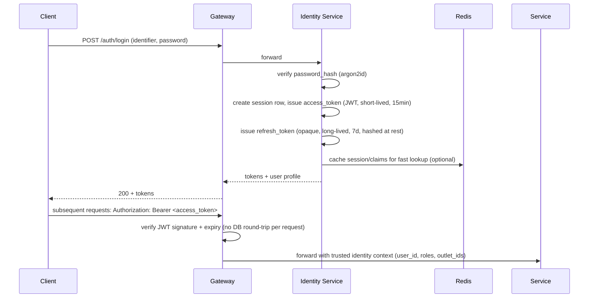

# 12 — Security Baseline

> **Scope note (UQ-03 resolution):** every rule in this document applies identically to both principal types Identity Service now issues tokens for — staff (`users`/`sessions`) and customers (`customer_accounts`/`customer_sessions`, `06-database-schema.md` §1.9–1.10). The two are never interchangeable (a customer token is rejected by every staff-only route, and vice versa — ADR-013 in `14-architecture-decisions.md`), but the hashing, session-rotation, rate-limiting, and logging rules below are the same code path for both, not a separately-maintained parallel implementation. `POST /api/v1/customer-auth/login` and `/password-reset/*` (`07-api-contract.md` §2) get the same brute-force rate limiting as `POST /api/v1/auth/login` (§9 below).

## 1. Password Hashing

- Algorithm: **argon2id** (memory-hard, resistant to GPU cracking), fallback bcrypt (cost 12) only if argon2id is unavailable in a given runtime.
- Never store, log, or transmit plaintext passwords. Passwords are never included in any event payload or audit log.

## 2. Authentication Flow

- **Access token:** short-lived JWT (15 min), signed (RS256/EdDSA), carries `sub` (user_id), `roles`, `outlet_ids`, `exp`. Stateless verification at the Gateway avoids a DB hit on every request.
- **Refresh token:** opaque random value, stored hashed in `sessions.refresh_token_hash`, rotated on every use (old one invalidated), long-lived (7 days), revocable (logout, admin-forced revoke).
- Claims embed outlet scope at issuance time; a change to a user's outlet assignment takes effect on next token refresh (acceptable staleness window of ≤15 min, documented trade-off).

## 3. Authorization

Enforced server-side at two layers (see `09-rbac.md` §3): Gateway-level route/role gate, then service-level fine-grained outlet-scope and resource-ownership checks. Frontend never treated as a security boundary.

## 4. Token / Session Management

- Refresh tokens are single-use with rotation; reuse of an already-rotated refresh token triggers **revocation of the entire session family** (theft detection heuristic).
- All sessions for a user can be force-revoked (e.g., on password change, admin action, suspected compromise).
- Access tokens are never persisted server-side (stateless); logout only revokes the refresh/session record — a still-valid access token issued before logout naturally expires within its short TTL.

## 5. Secret Management

- No secrets in source control. `.env.example` (placeholders only) is committed; real `.env` files are gitignored.
- Local/dev: Docker secrets or `.env` loaded via `docker compose --env-file`.
- Production target: a proper secret manager (Vault, cloud KMS-backed secret store) — Phase 0 mandates the abstraction (services read secrets from environment variables injected by the orchestrator, never hardcoded), leaving the concrete backend as a Phase 1+ infra decision.
- Database credentials are per-service (each service's DB role has grants scoped to its own logical database only — see `06-database-schema.md` conventions).

## 6. Input Validation

- All request bodies validated against a schema (struct tags / JSON schema) before touching domain logic — reject unknown fields where feasible to catch client/contract drift early.
- Validation happens at the service layer (not just the Gateway), since the Gateway cannot know business-specific rules (e.g., `price_per_unit > 0`).

## 7. SQL Injection Protection

- All database access goes through `pgx` with parameterized queries generated by `sqlc` — no string-concatenated SQL anywhere in the codebase (enforced by code review checklist and, where feasible, a lint rule).

## 8. Rate Limiting

- Enforced at the Gateway using Redis-backed counters (sliding window or token bucket), keyed by `(client_ip, route)` for public endpoints and `(user_id, route)` for authenticated ones.
- Stricter limits on `POST /auth/login` (brute-force protection) and `POST /orders`/`POST /payments` (abuse/spam protection).

## 9. CORS

- Gateway enforces an explicit allow-list of origins (the Next.js web app's domain(s)); no wildcard `*` in production. Credentials (cookies, if used for the web session) require exact origin match per the CORS spec.

## 10. CSRF

- Primary API auth is bearer-token based (Authorization header), which is not automatically attached by browsers to cross-site requests — this materially reduces CSRF exposure compared to cookie-based auth.
- If the web app additionally uses an HttpOnly cookie for refresh-token storage (recommended over `localStorage` for XSS resistance), CSRF protection (double-submit token or `SameSite=Strict/Lax` cookies) is required for any cookie-authenticated state-changing endpoint. This decision is deferred to Phase 1 frontend integration but the requirement is recorded here so it isn't missed.

## 11. Audit Logging

- Every state-changing action on Orders, Payments, Refunds writes both (a) a structured audit log entry (who, what, when, request_id) and (b) a domain audit row where applicable (`order_status_history`, `order_transfers`, `payment_transactions`). These are complementary: the audit log is for security/ops forensics, the domain audit rows are for business auditability (BR-23).
- Audit logs are append-only and shipped to a centralized log store (see `17` observability section below) — not solely reliant on application DB rows, so they survive even if application data is later archived.

## 12. Sensitive Data Handling

- PII inventory: customer name/phone/email/address, user email/phone. Minimized in logs (phone/email masked in structured logs, e.g., `+62812***890`).
- No payment card data is stored by this platform (Phase 0 assumes a PCI-scope-avoiding integration for CARD method — tokenized/hosted by the payment gateway in Phase 1+; `payment_transactions.gateway_response` must never contain raw card numbers/CVV).
- Passwords, tokens, and refresh-token values are never logged, even at DEBUG level.

## 13. API Idempotency

Covered in detail in `11-error-handling.md` §4 — `Idempotency-Key` header, per-endpoint requirement table in `07-api-contract.md` §12, backed by both an idempotency-key ledger and, for payments specifically, a DB-level partial unique constraint.

## 14. Service-to-Service Authentication

- All internal (Gateway→service, service→service) calls travel over the internal network but are still authenticated: each service validates a short-lived **internal service JWT** (separate signing key from user-facing tokens) asserting the calling service's identity, issued by a lightweight internal token mechanism or mTLS client certificates (either is acceptable; Phase 1 picks one — recorded as a Phase 1 prerequisite in `PHASE-0-REVIEW.md`).
- A service-to-service call never forwards the raw end-user access token as-is for authorization of the second hop without also asserting which service is making the call — this prevents a compromised service from impersonating arbitrary users to a third service beyond what the original request warranted.
- Network-level: services are not exposed outside the internal Docker network; only the Gateway has an external-facing port.

## 15. Summary Table

| Concern | Mechanism |
|---|---|
| Password hashing | argon2id |
| AuthN | JWT access token (15m) + rotating opaque refresh token (7d) |
| AuthZ | Server-side RBAC, two-layer (Gateway + service), outlet scope |
| Secrets | Env-injected, never committed, per-service DB credentials |
| Input validation | Schema validation at service layer |
| SQLi | pgx + sqlc parameterized queries only |
| Rate limiting | Redis-backed, per-IP and per-user, stricter on auth/payment |
| CORS | Explicit origin allow-list |
| CSRF | Bearer-token primary; cookie fallback requires CSRF token |
| Audit logging | Structured logs + domain audit tables |
| Sensitive data | PII masking in logs, no raw card data stored |
| Idempotency | `Idempotency-Key` + DB constraints |
| Service-to-service auth | Internal service JWT or mTLS (Phase 1 decision) |
